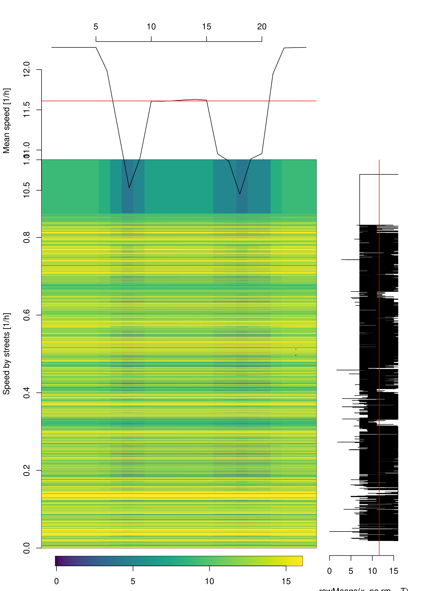
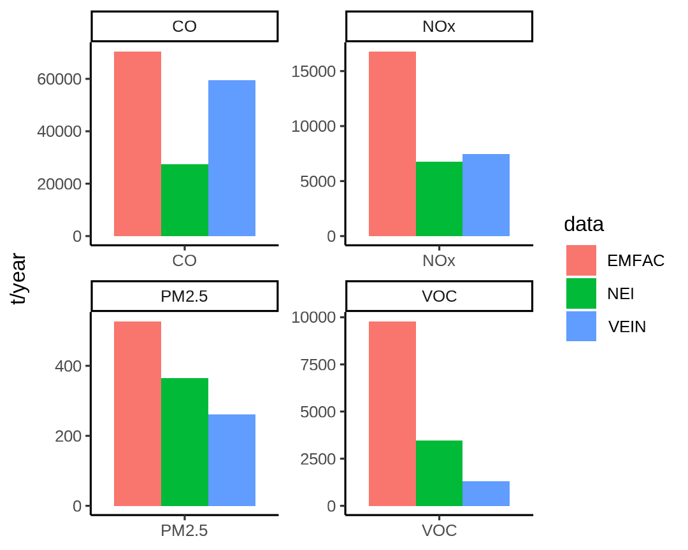
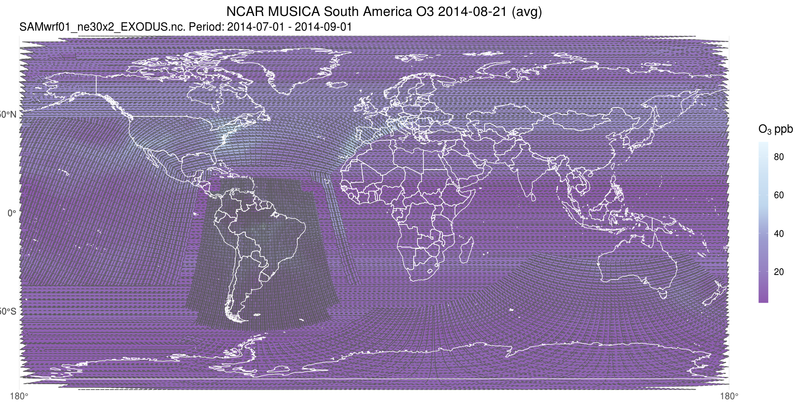

```{r setup, include=FALSE}
options(htmltools.dir.version = FALSE)
knitr::opts_chunk$set(
  fig.width=9, fig.height=3.5, fig.retina=3,
  out.width = "100%",
  cache = FALSE,
  echo = TRUE,
  message = FALSE, 
  warning = FALSE,
  hiline = TRUE
)
```

```{r xaringan-themer, include=FALSE, warning=FALSE}
library(xaringanthemer)
style_duo_accent(
  primary_color = "#1381B0",
  secondary_color = "#FF961C",
  inverse_header_color = "#FFFFFF"
)
library(vein)
```


class: inverse center middle
## VEIN model and future integration with MUSICA

> Sergio Ibarra-Espinosa¹'²
<br>
> 1 CIRES, University of Colorado-Boulder<br>
> 2 GML, National Oceanic and Atmospheric Administration (NOAA)<br>
> sergio.ibarra-espinosa@noaa.gov<br>
    
> Presentation for MUSICA group, ACOM/NCAR


---
class: centered inverse middle

> “Emission inventories are easily seen as the scapegoat if a mismatch is found between modelled and observed concentrations of air pollutants”. 

 Pulles, Tim, and Dick Heslinga. "The art of emission inventorying." TNO, Utrecht (2010): 29-53.
 
---
# Intro

.pull-left[
## Why do we need MUSICA? 


Empirical and modeling studies have provided strong evidence of dynamical and chemical coupling across the range of     spatial and temporal scales inherent in the Earth System. Current models, however, are inadequate in accounting for     the two-way coupling of the range of relevant scales **from street-level to regional to global** and from the surface   up to the mesosphere.
]

.pull-right[

## What is VEIN? 

[](http://cran.r-project.org/web/packages/vein) 
[](http://cran.r-project.org/package=vein)

- R package to calculate vehicular emissions
- Includes Fortran subroutines with // OpenMP
- Detailed speciation applying Carter [(2015)](https://www.tandfonline.com/doi/full/10.1080/10962247.2015.1013646)
- 13 direct publication [RG][https://www.researchgate.net/project/VEIN-An-R-package-for-vehicular-emissions-inventories]
]

---
# vein


---
# Characteristics

- Projects designed to produce comprehensiva inventories for people without knowledge in R 
- Imports sf package with bindings to GEOS, GDAL, PROJ and UDUNITS
- Imports data.table: [super fast] https://h2oai.github.io/db-benchmark/
- main paper: https://gmd.copernicus.org/articles/11/2209/2018/
- 33K dl, 3732 article views, 28 crossref
- YouTube Channel https://www.youtube.com/channel/UC2oYaS9mpnIDk8w55O8_bTg

### Process

- Top down (POLYGON) and bottom-up (LINESTRING)
- Activity adjusted by fuel consumption
- Activity and emission factors by age of use
- Includes methodolologies for China, US/EPA (MOVES), Brazil and Europe.
- **Gridded emissions with any polygon shape**
- Includes more than 10 chemical mechanisms

---

# Atmoschem R packages


.pull-left[

- **eixport** reads spatial emissions and generates inptus for air quality models - such as WRF CHEM
- **respeciate** Port the US/EPA Speciate 5.0 to R (no need of MS Access)
- **cptcity** (7120 colour palettes from cptcity web archive)
]

.pull-right[

[](http://cran.r-project.org/web/packages/eixport) 
[](http://cran.r-project.org/package=eixport)
[](https://github.com/atmoschem/eixport)


[](http://cran.r-project.org/web/packages/cptcity) 
[](http://cran.r-project.org/package=cptcity)
[](https://github.com/ibarraespinosa/cptcity)

]


---
class: inverse center middle
# Some applications

---
class: center middle
## Formaldehyde: 0.059 Mt/y


---
class: center middle
## NP 50 nm: 1.58E+26 /y


---
class: center middle
## NorthEast China


---

## Applications: Sao Paulo

.pull-left[
```{r, message = F, fig.align='center',  out.height='110%'}
library(sf)
library(vein)
x <- readRDS("rds/CO.rds")
g <- st_sf(
  geometry = st_make_grid(
    x = x,
    cellsize = 3000, 
    square = F))
co <- emis_grid(spobj = x,
                g = g)
```

]


.pull-right[

```{r, message = F, fig.align='center',  fig.height=6, fig.width=8}
plot(co[as.numeric(co$V9) > 0, "V9"],
     axes = T, lty = 0)

```
]

---
class: center
## WRF Chemi using eixport


<video width="520" height="440" controls>
<source src="wrfc.mp4" type="video/mp4" height="550"/>
  Your browser does not support the video tag.
</video>


---
class: inverse center middle
# Integration with US/EPA MOVES

---

## Recent Research: Integration of MOVES and VEIN:

- MOVES is the official vehicular emissions model for US. Runs on Windows, written in Java/SQL with MariaDB. VEIN is very versatile, ideal for traffic flow at streets. Currently has two approaches: 
- **1** Estimation using Windows with MOVES >3.0 installed. Emission factors are accessed using SQL in R.
- **2** Estimation using any OS. Emission factors are exported from Windows as .csv.gz and read with `data.table::fread`.
- Paper will be submitted to GMD (under development)

---
## Screenshots


```{r, eval = F, fig.align='center',  out.width='100%'}
vein::get_project(directory = "sacramento", case = "moves")
```


.pull-left[

```{r, echo = F, fig.align='center',  out.width='83%'}
knitr::include_graphics("figuras/main.png")
```

]

.pull-right[
```{r, echo = F, fig.align='center', out.width='75%'}

```

]
---

## Sacramento County 2017

.left-column[

- Traffic flow for a 4-stage travel demand model output for Sacramento Area, extracted for Sacramento County.'
- Traffic flow is for 2016 from CARB. 
- Traffic flow is total traffic volume 08:00-09:00.  
- Vehicular composition based on baltimore.
- Fuel consumption for 2017.
- Emission factors from Baltimore 2017.
- Temporal factors from hourly VMT MOVES Baltimore.
- Assumed BPR parameters.
]

.right-column[


```{r, echo = F, message = F, fig.align='center',  fig.height=6, fig.width=5}
net <- readRDS("rds/net.rds")
net <- st_transform(net, 4326)
mapview::mapview(net["PC"], 
                 color = cptcity::cpt(pal = "mpl_viridis"),
                 legend = FALSE)
```
]

---
class: center
## Speed parameters


.pull-left[

]

.pull-right[

]

---

## Emissions


.pull-left[

```{r, echo = F, fig.align='center',  out.width='93%'}

```

]

.pull-right[

```{r, echo = F, fig.align='center',  out.width='93%'}
knitr::include_graphics("figuras/no2mov.png")
```

]
---


## Spatial Emissions


```{r, echo = F, warning=FALSE, message=FALSE}
library(sf)
library(vein)
co <- readRDS("rds/pollutantID_2.rds")
l8 <- co[as.numeric(co$H8) > 0,"H8"]
g <- st_sf(
  geometry = st_make_grid(
    x = l8,
    cellsize = 3000, 
    square = F))
gco <- emis_grid(spobj = l8,
                g = g)
grid <- gco[as.numeric(gco$H8) > 0,"H8"]
mapview::mapview(l8, 
                 col.regions = cptcity::cpt(pal = "mpl_inferno"),
                 legend = FALSE) + mapview::mapview(grid, 
                 legend = FALSE)
```

---
class: inverse center middle
# Some advances using MUSICA

---
## MUSICA run over South America

```{r, echo = F, fig.align='center',  out.width='93%'}

```


---

## Geometry

- The idea is to re-construct geometry from the NetCDF file.
- Generate Well Known Text POLYGON, example:

```{r, eval=F}
POLYGON ((274.6966 -59.03607, 274.8997 -59.00577, 274.9453 -58.88916, 274.7924 -58.79595, 274.5942 -58.8158, 274.5485 -58.93235, 274.5485 -58.93235, 274.5485 -58.93235, 274.5485 -58.93235, 274.5485 -58.93235, 274.6966 -59.03607))

```

Corner Coordinates:

```{r, eval=F}
nc <- nc_open("/glade/p/cgd/amp/patc/GRID_REPO/ne0np4.SAMwrf01.ne30x2/grids/SAMwrf01_ne30x2_np4_SCRIP.nc")
lat <- ncdf4::ncvar_get(nc, "grid_corner_lat")
lat <- rbind(lat, lat[1, i])

lon <- ncdf4::ncvar_get(nc, "grid_corner_lon")
lon <- rbind(lon, lon[1, i])
geo <- sf::st_polygon(list(cbind(lon, lat)))

```

---

## Time series


```{r, echo = F, fig.align='center',  out.width='93%'}

```

---
## 2014-08-18

.pull-left[
```{r, echo = F, fig.align='center',  out.width='93%'}

```

]

.pull-right[

```{r, echo = F, fig.align='center',  out.width='93%'}

```

]

---
## VEIN Emissions

.pull-left[


]

.pull-right[


]


---
## Speciation

.pull-left[


]

.pull-right[
```{r, eval = F, fig.align='center',  out.height='83%'}
dx <- speciate(x = x, spec = "nmhc",
  fuel = "G", veh = "LDV", eu = "II")
unique(dx$pol) # g/km2
# ethane propane butane isobutane... 
```

mech options: "CB4", "CB05", "S99", "S7","CS7", "S7T", "S11", "S11D","S16C","S18B","RADM2", "RACM2","MOZT1", "CBMZ", "CB05opt2"

```{r, eval = F, fig.align='center',  out.width='93%'}
vocE25EX <- emis_chem2(df = dx, mech = "MOZT1")
unique(dx$group) # mol/km2
# BENZENE BIGALK BIGENE BZALD C2H2 C2H4
# C2H6  C3H6 C3H8 CH2O CH3CHO CH3COCH3
# MACR MEK TOLUENE XYLENES 
```

]

---
class invser center middle
# Gracias!

    - https://ibarraespinosa.github.io/2022NCARv2s
    - https://ibarraespinosa.github.io/
    - sergio.ibarra-espinosa@noaa.gov
    - https://scholar.google.com.br/citations?user=8ohZGHEAAAAJ
    - https://github.com/ibarraespinosa
    - https://www.researchgate.net/profile/Sergio_Ibarra-Espinosa
    - https://orcid.org/0000-0002-3162-1905

  
